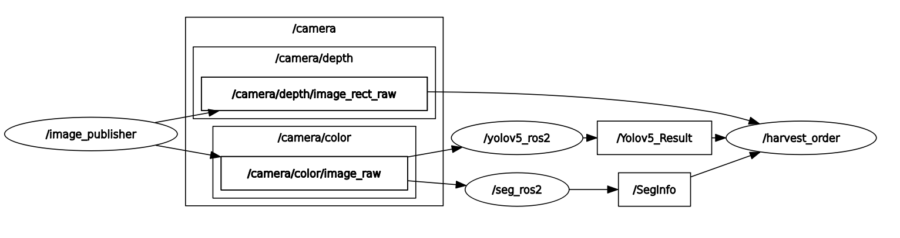
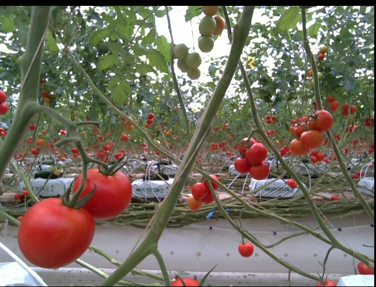
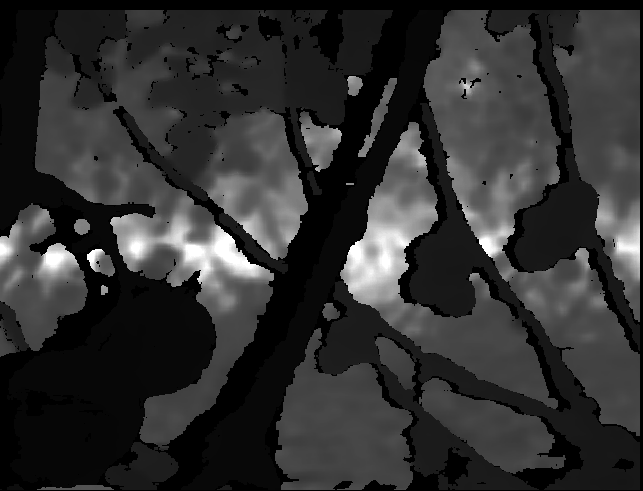

# vision_package
収穫ロボットのためのvisonシステム
- 画像取得
- 物体検知(YOLO)
- 障害物検知(deeplabv3)
- 収穫順番決定
　

基本的にrealsenseをもちいて動作する事を想定していますが、  
ない場合は"config/vision_package.yaml"内のcam_modeパラメータを  
video_camにすることでMidasによる単眼推定によるdepthに切り替えることができます。


# Install 
```
cd {your_ws}/src
git clone git@github.com:suke-toudara/vision_package.git
```

# Requirement
- pytorch

# topic list

/Detect_Image  
/SegInfo  
/Yolov5_Result  
/camera/color/image_raw  
/camera/depth/image_rect_raw  

**rqt_graph
<p align="left">
  
</p>

**/camera/color/image_raw**　　　　　　　　　　　　　　　　　　　　　　　　　　　　　　**/camera/depth/image_rect_raw**

<table>
    <tr>
        <td></td>
        <td></td>
    </tr>
</table>


# Author
yoshida keisuke 
mail : yoshida.keisuke6222@mail.kyutech.jp

# License